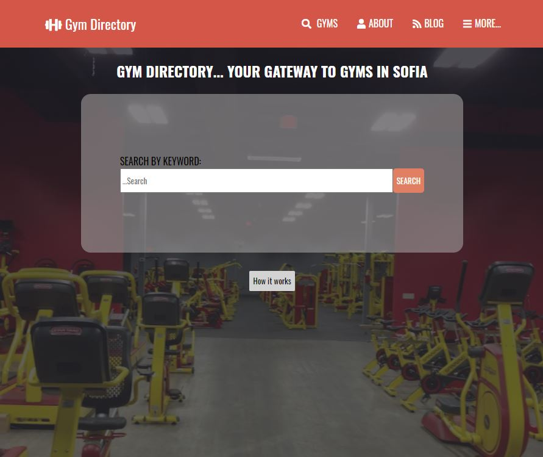

# GYM Directory project

> This is a Capstone final project for creating a webpage for GYM directory - Locator.



> This project is inspired by Mathew Njuguna.
> The project includes a header, navigation bar, body and footer.
> The project includes 3 pages - index, result and detail page.

## Built With

- HTML
- CSS

## Live Demo

[Live Demo Link](https://deikdesign.github.io/Gym-Directory/page/fitness_page.html)

## Getting Started

 To get a local copy up and running follow these simple example steps.

### Prerequisites
> Browser
> Text editor of your choice.
> npm has to be installed in your system.
> install linters on your IDE.

### Setup
> ``` git clone https://github.com/deikdesign/Gym-Directory.git ```

### Usage
> Open the index.html from your browser.

### Run tests
Run `npx html-validator-cli --quiet --file index.html` to run the validator over the ```index.html``` file.

## Authors

👤 **Deyan Todorov**
- Github: [@deikdesign](https://github.com/deikdesign)


## 🤝 Contributing

Contributions, issues and feature requests are welcome!

Feel free to check the [issues page](https://github.com/deikdesign/Gym-Directory/issues).

## Show your support

Give a ⭐️ if you like this project!

## 📝 License

This project is [MIT](lic.url) licensed.
=======
# Gym-Directory
Capstone final project - School Directory
